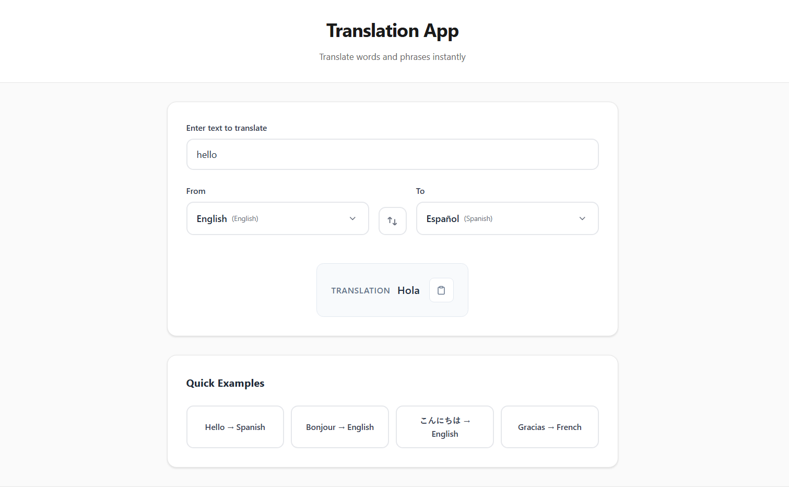

# Translation App

A modern, user-friendly React application for translating words and phrases between multiple languages. Built with React and powered by the translate package.



## 🌟 Features

- **Multi-language Support**: Translate between 13 different languages including English, Spanish, French, German, Italian, Portuguese, Russian, Japanese, Korean, Chinese, Arabic, Hindi, and Tamil
- **Real-time Translation**: Instant translation as you type
- **Language Swapping**: Easy one-click language swapping with intuitive UI
- **Quick Examples**: Pre-loaded examples to get you started quickly
- **Responsive Design**: Works seamlessly on desktop and mobile devices
- **Modern UI**: Clean, intuitive interface with smooth animations

## 🚀 Getting Started

### Prerequisites

- Node.js (version 14 or higher)
- npm or yarn package manager

### Installation

1. Clone the repository:
```bash
git clone https://github.com/s-abdullah-7/TranslateApp.git
cd TranslateApp
```

2. Install dependencies:
```bash
npm install
```

3. Start the development server:
```bash
npm start
```

4. Open [http://localhost:3000](http://localhost:3000) to view it in the browser.

## 🛠️ Built With

- **React** - Frontend framework
- **React Scripts** - Build tools and development server
- **Translate Package** - Translation API integration
- **CSS3** - Styling and animations

## 📁 Project Structure

```
TranslateApp/
├── assets/
│   └── image.png          # App screenshot
├── public/
│   └── index.html         # HTML template
├── src/
│   ├── components/
│   │   ├── CustomDropdown.js      # Language selection dropdown
│   │   └── TranslationComponent.js # Main translation logic
│   ├── App.js             # Main application component
│   ├── App.css            # Application styles
│   ├── index.js           # Application entry point
│   └── index.css          # Global styles
├── package.json           # Dependencies and scripts
└── README.md             # This file
```

## 🎯 Usage

1. **Enter Text**: Type or paste the text you want to translate in the input field
2. **Select Languages**: Choose the source language (From) and target language (To) using the dropdown menus
3. **Translate**: The translation will appear automatically in the result section
4. **Swap Languages**: Click the swap button to quickly reverse the translation direction
5. **Try Examples**: Use the quick example buttons to see the app in action

## 🌍 Supported Languages

- 🇺🇸 English (en)
- 🇪🇸 Spanish (es)
- 🇫🇷 French (fr)
- 🇩🇪 German (de)
- 🇮🇹 Italian (it)
- 🇵🇹 Portuguese (pt)
- 🇷🇺 Russian (ru)
- 🇯🇵 Japanese (ja)
- 🇰🇷 Korean (ko)
- 🇨🇳 Chinese (zh)
- 🇸🇦 Arabic (ar)
- 🇮🇳 Hindi (hi)
- 🇮🇳 Tamil (ta)

## 🔧 Available Scripts

- `npm start` - Runs the app in development mode
- `npm run build` - Builds the app for production
- `npm test` - Launches the test runner
- `npm run eject` - Ejects from Create React App (one-way operation)

## 📱 Screenshots

The application features a clean, modern interface with:
- Intuitive language selection dropdowns
- Real-time translation display
- Quick example buttons for easy testing
- Responsive design for all screen sizes

## 🤝 Contributing

1. Fork the project
2. Create your feature branch (`git checkout -b feature/AmazingFeature`)
3. Commit your changes (`git commit -m 'Add some AmazingFeature'`)
4. Push to the branch (`git push origin feature/AmazingFeature`)
5. Open a Pull Request

## 📄 License

This project is open source and available under the [MIT License](LICENSE).

## 👨‍💻 Author

**Abdullah S**

- **GitHub**: [s-abdullah-7](https://github.com/s-abdullah-7)
- **Portfolio**: [abdullahs.info](https://www.abdullahs.info/)

## 🙏 Acknowledgments

- Built with [Create React App](https://github.com/facebook/create-react-app)
- Translation powered by the [translate](https://www.npmjs.com/package/translate) package
- Icons and UI elements designed for optimal user experience

---

⭐ If you find this project helpful, please give it a star on GitHub!
